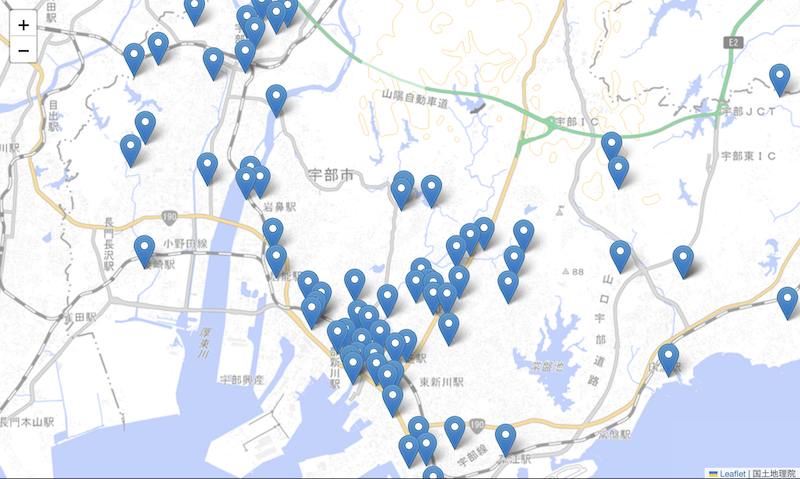

# オープンデータでつくる、わたしのまちマップ
## はじめてのジオメディア

まちのオープンデータを使って、自分だけのオリジナルマップを作るハンズオンです。

**データを探す → 整える → GeoJSONに変換する → 地図にする → カスタマイズする**

プログラミングやWeb開発が初めての方も大歓迎です。

## 本日のゴール

### 【その１】オープンデータを加工して地図にピンを立てます。
ピンにカーソルを合わせると、名称が表示されます。


### 【その２】ピンを立てた地図をWebブラウザで表示します。

---

## 0. 事前準備

### 必要なもの
- ノートPC
- Webブラウザ（Google Chrome推奨）
- Googleアカウント（Google Colabを使用します）

ソフトウェアのインストールは不要です。

### あると便利
- ChatGPT、Geminiなどの生成AI

後半のカスタマイズで、コードの相談相手として使えます。

---

## 1. オープンデータを探そう

地図にしてみたいオープンデータを探します。
今回は、**緯度・経度が含まれているExcelまたはCSV**がおすすめです。

観光スポット、公共施設、公園、子育て、防災、バリアフリー情報などを探してみましょう。

今回のサンプルは、[宇部市「公衆トイレ一覧」](https://yamaguchi-opendata.jp/ckan/dataset/352021_ubetoile)データを用いています。

---

## 2. データを共通フォーマットに整えよう

オープンデータは公開元によって列名や形式が異なります。
Excel / スプレッドシートで列の意味を確認し、次の名前に整えます。

### 必須の3項目

| 列名 | 内容 |
| --- | --- |
| `name` | 場所・施設の名前 |
| `latitude` | 緯度 |
| `longitude` | 経度 |

### あると便利な項目

| 列名 | 内容 |
| --- | --- |
| `category` | 分類 |
| `address` | 住所 |
| `description` | 説明 |

`hours`、`url`、`phone`、`capacity` など、それ以外の列は残してOKです。

> **ルール：`name` / `latitude` / `longitude` の3列だけは必ずこの名前にします。**

その他の列は、GeoJSONの `properties` に自動的に入ります。

---

## 3. Google Colabで読み込もう

`colab/excel_to_geojson.ipynb` をGoogle Colabで開きます。

Colab左側の **Files** から、整えたExcelまたはCSVをアップロードし、
Notebookのセルを上から順番に実行します。

---

## 4. GeoJSONに変換しよう

GeoJSONは地図の情報を扱えるJSON形式です。

- **geometry** = 「どこにある？」
- **properties** = 「そこに何がある？」

```json
{
  "type": "Feature",
  "geometry": {
    "type": "Point",
    "coordinates": [131.25, 33.95]
  },
  "properties": {
    "name": "サンプル公園",
    "category": "公園"
  }
}
```

### 注意
表では `latitude / longitude` と扱いますが、GeoJSONの座標は

**`[longitude, latitude]` = [経度, 緯度]**

の順です。

---

## 5. 地図で見てみよう

NotebookではFoliumを使って地図を表示します。FoliumはLeafletを利用しています。

**OpenStreetMap（背景地図）＋ GeoJSON（データ）＋ Leaflet（表示の仕組み）**

という関係を確認してみましょう。

---

## 6. 自分だけのMAPにカスタマイズしよう

例えば次のようなカスタマイズができます。

- ピンの色を変えたい
- ピンをクリックしたときの情報を増やしたい
- データの内容によってピンの色を変えたい
- 条件に合う場所だけ表示したい
- アイコンを変えたい

[生成AIを用いたカスタマイズ方法](AI_CUSTOMIZE.md)を参考に編集してみましょう。

「公衆トイレ一覧」を例にしたカスタマイズ方法は[こちら](CUSTOMIZE.md)

---

## 7. Webページとして表示してみよう
### ※Githubアカウントを持っている人、プログラミング経験者向け

`map/index.html` は、同じフォルダの `mapdata.geojson` をLeafletで表示するサンプルです。

```text
map/
├── index.html
└── mapdata.geojson
```

GitHub PagesなどのWebサーバー上に置くと、Web地図として表示できます。

---

---

## License

© 2026 Chie Mizuta

この教材は [Creative Commons Attribution 4.0 International (CC BY 4.0)](https://creativecommons.org/licenses/by/4.0/deed.ja) のもとで公開しています。

授業・研修・ワークショップ等で、複製・編集・改変・再配布して利用できます。
利用の際は、原著作者として「Chie Mizuta」の表示をお願いします。

なお、本教材で利用しているオープンデータ、地図、ライブラリ等の第三者著作物については、それぞれの提供元の利用規約・ライセンスが適用されます。
