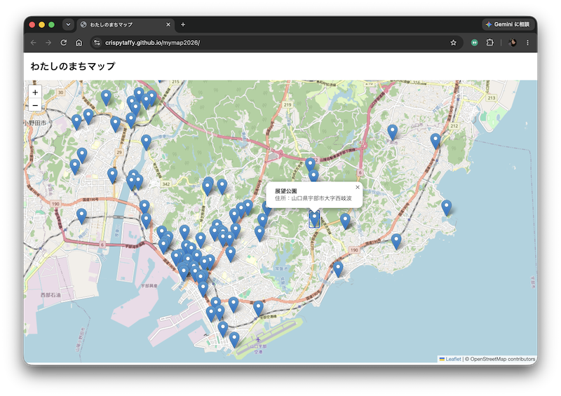

# オープンデータでつくる、わたしのまちマップ
## はじめてのジオメディア 🗺️🔍

まちのオープンデータを使って、自分だけのオリジナルマップを作るハンズオンです。  

**データを探す → 整える → GeoJSONに変換する → マップにする → カスタマイズする**

プログラミングやWeb開発が初めての方向けに作成しています。

---

## 本日のゴール・その1
### オープンデータを加工して、マップにピンを立てます。

最初はGoogle Colabを使って、Notebook上で地図を表示します。


---

## 本日のゴール・その2
### つくったマップをWebページとして表示してみます。

GitHubアカウントを持っている方は、GitHub Pages使ってWeb公開もできます。



[Sample「宇部市公衆トイレマップ」](https://crispytaffy.github.io/mymap2026/)

---

## 0. 事前準備

### 必要なもの
- ノートPC
- Webブラウザ（Google Chrome推奨）
- Googleアカウント（Google Colabを使用します）

ソフトウェアのインストールは不要です。

### あると便利
- ChatGPT、Geminiなどの生成AI（後半のカスタマイズで使用します）

---

## STEP 1. オープンデータを選ぶ

マップにしてみたいオープンデータを探して、ダウンロードします。
観光スポット、公共施設、公園、子育て、防災、バリアフリー情報などを探してみましょう。

本日は[山口県オープンデータカタログサイト](https://yamaguchi-opendata.jp/)からデータを選びましょう。

**緯度・経度が含まれているExcelまたはCSV** を選んでください。

今回のサンプルでは、[宇部市「公衆トイレ一覧」](https://yamaguchi-opendata.jp/ckan/dataset/352021_ubetoile)データを用いています。

---

## STEP 2. データを共通フォーマットに整えよう

オープンデータは公開元によって列名や形式が異なりますが、項目に含まれるデータの意味が同じものは共通フォーマット（GeoJSON）で扱うことができます。  

### GeoJSONとは
* GeoJSONはJavaScript Object Notation（JSON）を用いて空間データをエンコードし非空間属性を関連付けるファイルフォーマットである。-- [wikipedia](https://ja.wikipedia.org/wiki/GeoJSON)

---

### 必須（必ず変更する）

| 列名 | 内容 |
| --- | --- |
| `name` | 場所・施設の名前 |
| `latitude` | 緯度 |
| `longitude` | 経度 |

ダウンロードした Excel / スプレッドシートを確認して、地図でピンを立てる際に必須となる地点の名称と緯度・経度の3項目を **`name` / `latitude` / `longitude` という項目名に統一します。**

---

### 任意（その他、あると便利な項目）

| 列名 | 内容 |
| --- | --- |
| `category` | 分類 |
| `address` | 住所 |
| `description` | 説明 |

任意の項目や `hours`、`url`、`phone`、`capacity` などは、変更せずにそのまま残してOKです。元データにある列を削除する必要はありません。あとでマップの表示やカスタマイズに利用できます。　　

---

データをGeoJSONに変換する際には、latitude / longitude は **geometry（位置情報）** になります。  

それ以外の列は、すべて **properties（場所に関する情報）** として自動的に保存されます。  

### 項目名を変更した後は、わかりやすい任意のファイル名で保存します。


---

## STEP 3. Google Colabにコードを読み込む

`colab/excel_to_geojson.ipynb` をダウンロードし、Google Colabの **「Notebookをアップロード」** で開きます。ここから STEP5 のマップ表示まで、Google Colab内にてPythonで実行します。

Notebookを開いたら、Colab左側の **Files** から、先ほど（2で）項目名を変更したExcelまたはCSVをアップロードします。

Filesにファイルが表示されたのを確認したら、Notebookのセルを上から順番に実行します（三角マークを押す）。手順の説明に従って、実行内容を確認しながら次に進んでください。

---

## STEP 4. GeoJSONに変換しよう

データに必要な項目が揃っていることが確認できたら、データをGeoJSONに変換します。GeoJSONとは、マップの情報を扱えるJSON形式です。

- **geometry** = 「どこにある？」（緯度・経度）
- **properties** = 「そこに何がある？」

```json
{
  "type": "Feature",
  "geometry": {
    "type": "Point",
    "coordinates": [131.25, 33.95]
  },
  "properties": {
    "name": "サンプル公園",
    "category": "公園"
  }
}
```

---

GeoJSONに変換できたら、Filesに「mapdata.geojson」が出力されていることを確認してください。

### 注意
データ上は、緯度 → 経度の並び順で `latitude / longitude` となるケースが多いですが、GeoJSONの座標は **`[longitude, latitude]` = [経度, 緯度]** の順となります。


---

## STEP 5. Notebook上のマップで見てみよう

Google ColabのNotebook上で、Foliumを使ってマップを表示してみましょう。FoliumはLeafletを利用しており、Pythonで地図を作成し、ピンを立てて表示することが可能です。

### Folium（フォリウム）とは
Pythonでインタラクティブなマップを作成・操作できるオープンソースライブラリです。

### Leaflet（リーフレット）とは
オープンソースのWebマップを作成するためのJavaScriptライブラリです。

---

マップへのデータ表示は、

**国土地理院（背景マップ）＋ GeoJSON（データ）＋ Leaflet（表示の仕組み）**

という階層になっています。

今回は背景マップとして、国土地理院の「淡色地図」を指定しています。

---

マップが表示されたら、ピンが正しい場所に表示されているか確認しましょう。

ここからは、2つの方法でマップをカスタマイズできます。

- **GitHubアカウントを持っていない方**  
  → STEP 6へ。Foliumで表示したマップをそのままカスタマイズします。

- **GitHubアカウントを持っている方**  
  → STEP 7へ。ここまでのFolium表示をGeoJSONのビューチェックとして、`mapdata.geojson` を使ったWebマップ作成に進みます。

---

## STEP 6. マップをカスタマイズしよう🔰

> GitHubアカウントを持っている人は **STEP7** にスキップ

地図のピン表示は、次のようなカスタマイズができます。

```text
- ピンをクリックしたときに表示する情報を増やす
- ピンの色やアイコンを変更する。データの内容によってピンの表示を変えることも可
- 条件に合う場所のピンだけを表示する
```

[生成AIを用いたカスタマイズ方法](AI_CUSTOMIZE.md)を参考に編集してみましょう。

---

## STEP7. Webページとして表示してみよう💻
### ※GitHubアカウントを持っている人、プログラミング経験者向け

STEP 5でGeoJSONが正しくマップに表示されることを確認できたら、
`mapdata.geojson` をColabからダウンロードします。

ここからはPython / Foliumを離れて、同じGeoJSONを
**HTML + JavaScript + Leaflet** でWebマップとして表示してみましょう。

---

ハンズオン資料にある `map/index.html` は、同じフォルダにある `mapdata.geojson` をLeafletで表示するサンプルです。

```text
map/
├── index.html
└── mapdata.geojson
```

GitHub PagesなどのWebサーバー上に置くと、Webマップとして表示できます。
index.htmlをカスタマイズして、自分だけのオリジナルマップを作成してくださいね。

---

# マップ完成 & 発表会 🎉

オープンデータから、自分だけのマップを作ることができました。

**探す → 整える → GeoJSON → マップ → カスタマイズ**

参加したメンバー同士で、どんなマップができたか発表し合いましょう！

---